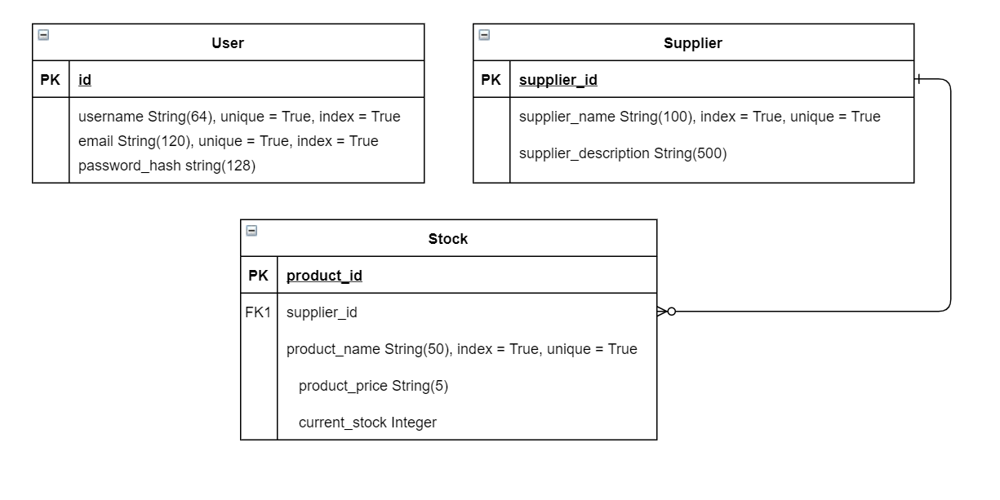
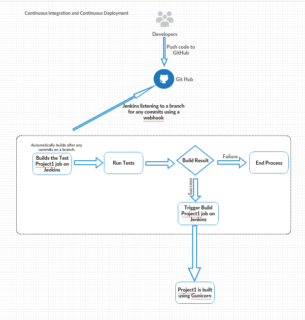
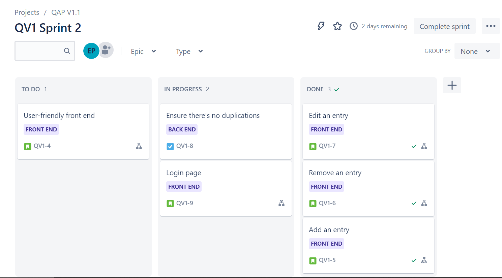
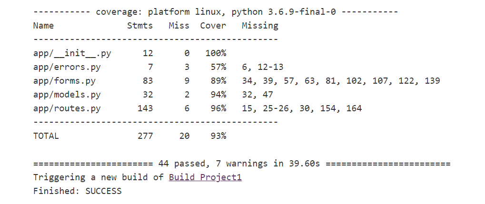

### Project 1
# Stock counting app

## Base requirements:
---
For this project we were tasked with creating an app with basic CRUD (create, read, update, delete) functionality, using a variety of different methods and tools to ensure that the development, testing, and deployment all went as smoothly as possible.\
\
Some of the tools and systems that we used were:\
Python to write the back-end of the application\
GCP (for both the Virtual Machine and for the database)\
A Jira board\
A database containing at least one relationship\
Basic HTML to display our app on web pages\
Pytest to thorougly test our application\
Jenkins to automate the testing and deployment of our app\
Flask to help integrate our HTML and Python code seamlessly\
A version control system (in this case GitHub), which can also be used to assist in the automated testing and deployment.\
Selenium for integration testing

## My app:
---
For this project I've decided to create a stock counting system, which contains a variety of different features.\
I am able to create new users, suppliers, and products, satisfying the create criteria.\
I am able to view the users, suppliers, and products individually, as well as an overview of all the products, satisfying the read criteria.\
I am able to edit users, suppliers, and products, satisfying the update criteria.\
I am able to delete suppliers and products, satisfying the delete criteria.

For my create functionalities, I'm able to create a variety of different types of database fields.\
In my User table, I can create and store:\
ID\
Username\
Email\
Password hash\
\
In my Supplier table, I can create and store:\
SupplierID\
Supplier Name\
Supplier Description\
\
In my Stock table, I can create and store:\
Product ID\
Product Name - the name of the product\
Product Price - how much the product costs\
Supplier - the supplier that supplies the product\
Current Stock - how much of that product is currently in stock\
\
When a user is logged in, they're also allowed to edit several fields, including:\
On their account, they can edit their username and email.\
For stock, they can edit individual products.\
For suppliers, they can edit the supplier name and ID.\
In the future, I'd like to implement being able to change the password, which in theory would be a relatively easy edit to make. I'd also like to be able to make a lost-password form, but that would require a way to contact them outside of the app which is beyond my current skill level.

## Architecture:
---
When creating my database, I created a simple ERD so that I could visualise the creation of the database before actually making it, and ensure that the relationship was a viable one that would fulfill the needs of the app. It also prevented me from over-complicating the database, as I was able to see exactly what fields I had.

The actual deployment of the application was done using a CI server. This allowed seamless transition from a coding environment, to the source control, to testing, and eventually to deployment.

The above image shows the workflow of my code, from coding, to my source control, through testing, and onto deployment if the testing succeeds.\
To go into a little more depth, when I edit any code and push it to GitHub, GitHub will send out a packet to Jenkins, letting it know that a change has been made, and that it should start the process of testing and rebuilding the application. Jenkins then starts the testing job, and if completed successfully (meaning all the tests passed), then it will then start to build the application from the master branch on GitHub. This means that should the tests fail, the built project will stay as the branch that works so that no errors are introduced to the deployed application in the chance that someone has pushed broken code to the master branch.\
Unfortunately, it also means that every time someone pushes code to any of the other branches (testing, documentation, dev, etc), the whole application will restart with no changes having been made.\
This is not too much of an issue as the user-base for this application is very small, and so a minute or twos downtime isn't too serious, but if the application and its userbase were to grow you culd get around this by having separate jobs for the testing branches and the master branch, so that the working application would not restart unless there was actually an update on the master branch.

I also used a Jira board to help with time management and organisation.

While it's quite a basic Jira board, each task shown above has multiple sub-tasks that are required, as do the ones that aren't shown due to be completed/not in that sprint.

## Testing:
---
For testing I used Pythons unittest module, as well as Selenium for integration testing. With these technologies I achieved a 93% coverage with my tests, meaning that the vast majority of my application was tested in one way or another.\

## Future Improvements:
---
In the future I'd like to implement separate databases for each user, or specific groups of users, so that most users can only access their own database. This would allow for expansion of the service provided, as it could service multiple different sites, each with their own stock database.\
I'd also like to implement a page where I can view all of the suppliers, so that I can edit them easily. A search function that searches both the suppliers and the stock would also be helpful, preferably with a filter so that you can search for either or.\
There is also more validation that could be implemented to ensure that the data being entered is valid and correct, and that data cannot be easily deleted.

## Current Bugs:
---
There are currently a few known bugs in the application that I could not fix, either due to time restraints or because of a lack of knowledge, and some of these are listed below.\
Editing - when editing any information, you are unable to keep any information the same. This means that if you want to edit your username on your profile, you'd also have to change your email, or if you wanted to edit the supplier on a product you'd also have to change the product name. This is because to keep those the same would require the use of *args and **kwargs, which I don't fully understand and so did not implement.

## Author:
---
Ed Prickett

## Acknowledgements:
---
CA Academy for teaching me the skills to implement this project.\
Luke Benson for being patient with my many questions.
